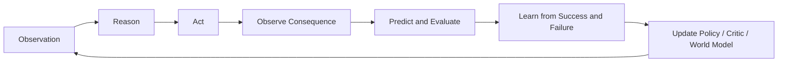
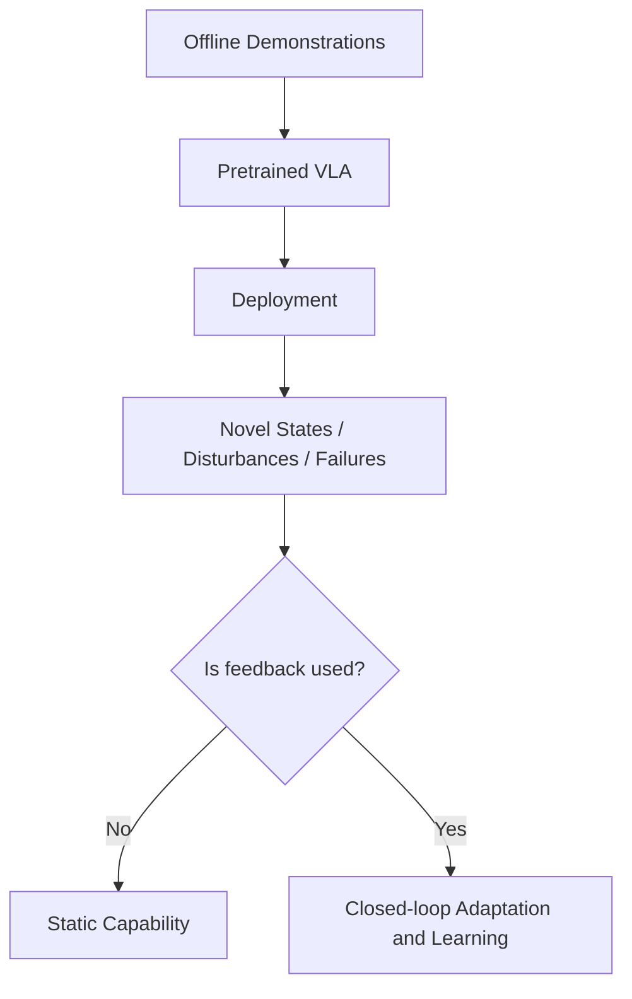
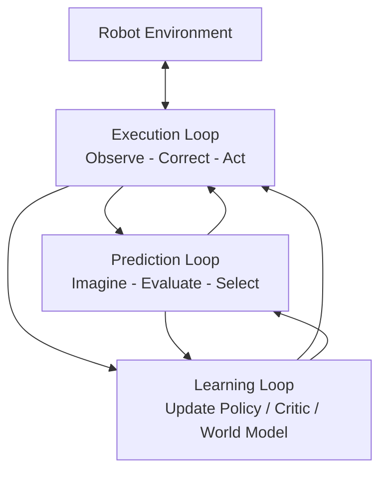
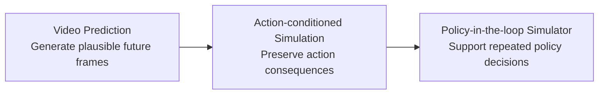
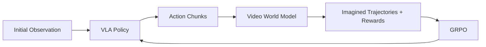
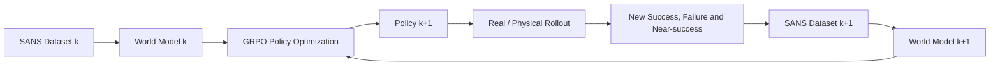
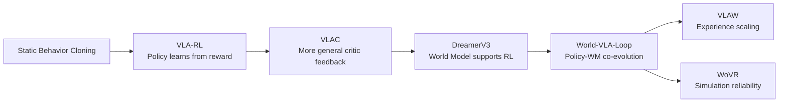
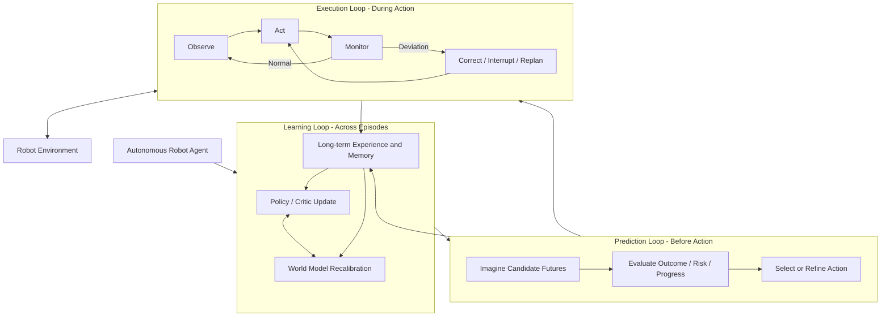
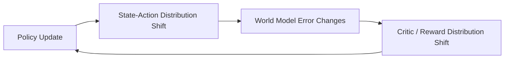
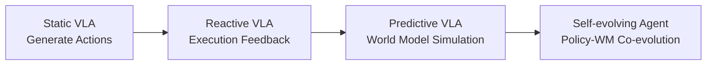

# Awesome Closed-Loop VLA

**English** | [简体中文](README_zh.md)

> **Survey**: Closed-Loop Vision-Language-Action Agents: From Closed-loop Execution to Self-evolving Robotic Agents
>
> **Core Idea**: The evolution of VLA capabilities comes not only from larger models and more demonstration data, but from feedback, prediction, and learning progressively entering the robot's decision-making loop.

---

## Table of Contents

- [Abstract](#abstract)
- [1. From Static VLA to Closed-loop Robot Agents](#1-from-static-vla-to-closed-loop-robot-agents)
  - [1.1 What Static VLA Can and Cannot Do](#11-what-static-vla-can-and-cannot-do)
  - [1.2 Closed-loop Capability Is Not "Calling the Model More Times"](#12-closed-loop-capability-is-not-calling-the-model-more-times)
- [2. The Three Loops of Closed-loop VLA](#2-the-three-loops-of-closed-loop-vla)
- [3. Execution Loop: From Action Generation to Real-time Correction](#3-execution-loop-from-action-generation-to-real-time-correction)
  - [3.1 Why Do We Need an Execution Loop?](#31-why-do-we-need-an-execution-loop)
  - [3.2 Candidate Selection: From One-shot Generation to Generate-Verify-Execute](#32-candidate-selection-from-one-shot-generation-to-generate-verify-execute)
  - [3.3 Execution-time Correction: From Pre-execution Selection to Mid-execution Recovery](#33-execution-time-correction-from-pre-execution-selection-to-mid-execution-recovery)
  - [3.4 Interim Conclusions for the Execution Loop](#34-interim-conclusions-for-the-execution-loop)
- [4. Prediction Loop: The World Model as an Internal Simulator](#4-prediction-loop-the-world-model-as-an-internal-simulator)
  - [4.1 The Changing Role of the World Model](#41-the-changing-role-of-the-world-model)
  - [4.2 Action Representation](#42-action-representation)
  - [4.3 Policy-in-the-loop: From Replaying Videos to Simulating Decision-making](#43-policy-in-the-loop-from-replaying-videos-to-simulating-decision-making)
  - [4.4 Interim Conclusions for the Prediction Loop](#44-interim-conclusions-for-the-prediction-loop)
- [5. Learning Loop: From Policy Adaptation to Autonomous Evolution](#5-learning-loop-from-policy-adaptation-to-autonomous-evolution)
  - [5.1 Policy-centric Learning Loop](#51-policy-centric-learning-loop)
  - [5.2 World Models Enter the Learning Loop](#52-world-models-enter-the-learning-loop)
  - [5.3 World-VLA-Loop: Policy-World Model Co-evolution](#53-world-vla-loop-policy-world-model-co-evolution)
  - [5.4 Beyond World-VLA-Loop: Experience Scale and Simulation Reliability](#54-beyond-world-vla-loop-experience-scale-and-simulation-reliability)
  - [5.5 Interim Conclusions for the Learning Loop](#55-interim-conclusions-for-the-learning-loop)
- [6. A Unified Closed-loop Robot Intelligence Stack](#6-a-unified-closed-loop-robot-intelligence-stack)
- [7. Open Challenges](#7-open-challenges)
  - [7.1 Trustworthy World Models](#71-trustworthy-world-models)
  - [7.2 Failure-driven Learning](#72-failure-driven-learning)
  - [7.3 Policy-World Model Stability](#73-policy-world-model-stability)
  - [7.4 Multi-timescale Intelligence](#74-multi-timescale-intelligence)
- [8. Conclusion](#8-conclusion)
- [References](#references)

---

## Abstract

Vision-Language-Action (VLA) models, which jointly model visual observations, language instructions, and robot actions, are driving robots from task-specific policies toward general foundation models. However, most current VLAs still rely primarily on offline imitation learning: the model is trained before deployment and generates actions based on the current observation at deployment time, but rarely turns real-time deviations, failed trajectories, and predictions of the future back into new decision-making capability. This forms a fundamental tension: **VLAs' semantic and action priors keep growing stronger, yet the robot's ability to exploit feedback in the real environment remains limited.**

This article proposes a unified perspective: VLAs are evolving from static action predictors into robotic agents capable of closed-loop execution, future simulation, and continual evolution. This evolution consists of three progressively stronger, mutually nested loops:

1. **Execution Loop**: during a single task execution, use real-time observations, action uncertainty, or deviation monitoring to alter actions that have not yet been executed.
2. **Prediction Loop**: before actions are physically executed, use an action-conditioned world model to generate candidate futures and evaluate the consequences of different policies or actions.
3. **Learning Loop**: across multiple rounds of interaction, convert environmental feedback, failure experience, and imagined rollouts into parameter updates for the policy, critic, and world model.

These three correspond to three timescales of robotic intelligence: the Execution Loop asks "how do I correct the current action," the Prediction Loop asks "how do I anticipate before acting," and the Learning Loop asks "how do I get stronger after each round." From this perspective, the goal of a VLA is no longer simply to implement

$$
o_t,\ell \longmapsto a_t,
$$

but to build a perception-action-prediction-evaluation-learning system that can run continuously.

---

# 1. From Static VLA to Closed-loop Robot Agents

## 1.1 What Static VLA Can and Cannot Do

Current VLAs typically learn the conditional mapping between vision, language, and action via behavior cloning:

$$
a_t \sim \pi_\theta(a_t \mid o_t,\ell),
$$

where \(o_t\) denotes the current visual or multimodal observation, \(\ell\) the task instruction, and \(a_t\) a single-step action or action chunk. Large-scale demonstration data provides the policy with rich semantic priors, object manipulation patterns, and cross-task generalization, enabling the model to complete complex manipulation near the training distribution.

However, from a closed-loop perspective, static VLAs implicitly make three strong assumptions:

- the current observation is sufficient to determine subsequent actions;
- the environment will not shift significantly during action execution;
- new experience generated during deployment does not need to further update the model.

Real robots typically violate these assumptions. Gripper misalignment, object slippage, collisions, occlusion, and external disturbances can drive the robot into states not covered by the demonstration data. More importantly, a small error changes subsequent observations, gradually invalidating actions that were originally reasonable. Even if a static policy sees new images, it may continue executing action chunks generated from an old state; even if it experiences the same kind of failure repeatedly, it does not update itself automatically.

Therefore, closed-loop VLA is not a simple replacement of behavior cloning, but a complement to its capability boundary. Imitation learning answers "where does the robot start," and the closed-loop system further answers:

- **Execution level**: how to correct when the current action deviates?
- **Prediction level**: can we compare different futures before execution?
- **Learning level**: after a failure, are we stronger next time?

## 1.2 Closed-loop Capability Is Not "Calling the Model More Times"

The key to a closed loop is not to increase the number of inference calls, but whether **new information can change subsequent behavior**. For example, sampling multiple candidate actions and reranking them with a verifier can improve pre-execution decision quality; but if a long action chunk is still executed in full once selected, the system's response to sudden disturbances remains limited. Conversely, a lightweight residual corrector, even with little computation, forms a more direct physical execution loop as long as it can continuously read the latest observations and modify the current action.

Therefore, when analyzing closed-loop VLA, we need to distinguish:

- whether feedback comes from the real environment or an imagined world;
- whether feedback takes effect before execution, during execution, or across episodes;
- whether feedback only changes actions, or further changes the parameters of the policy, critic, or world model;
- whether the loop occurs at millisecond, second, or multi-round deployment scales.

These distinctions form the basic boundaries of the three loops in this article.

---

# 2. The Three Loops of Closed-loop VLA

| Loop | Core Question | Main Feedback Source | Typical Update Target | Timescale | Representative Capability |
|---|---|---|---|---|---|
| **Execution Loop** | What to do if the current action is wrong? | Latest real observations, action uncertainty, deviation monitoring | Current action, execution prefix, action queue | Milliseconds to seconds | Reactive correction |
| **Prediction Loop** | What might happen next? | Future states generated by the world model, policy evaluation signals | Candidate actions, plan or policy ranking | Second-level planning cycle | Predictive decision-making |
| **Learning Loop** | How to keep getting stronger across rounds of interaction? | Environmental reward, critic, failure data, imagined rollouts | Policy, critic, world model | Multi-round training and deployment | Capability evolution |

The three loops are not mutually exclusive categories, but a structure of progressively stronger capabilities. The Execution Loop can operate without a world model; the Prediction Loop can be used only for evaluation without updating the policy; the Learning Loop further consolidates the real feedback and predicted consequences generated by the first two loops into parameter updates.

From a systems perspective:

- the Execution Loop ensures a single task does not fail immediately due to local deviations;
- the Prediction Loop broadens the decision-making horizon before real actions occur;
- the Learning Loop turns local feedback and imagined experience into long-term capability.

---

# 3. Execution Loop: From Action Generation to Real-time Correction

## 3.1 Why Do We Need an Execution Loop?

Modern VLAs, to improve action coherence and inference throughput, typically generate an action chunk of length \(H\) at once:

$$
A_t = (a_t,a_{t+1},\ldots,a_{t+H-1})
\sim \pi_\theta(\cdot \mid o_t,\ell).
$$

The system actually executes only the first \(h\) steps before re-invoking the policy. Here we need to distinguish **generation length \(H\)** from **execution length \(h\)**: the model may generate a long action sequence, but the system need not execute all of it. The key to closed-loop design is precisely to choose \(h\) dynamically, balancing efficiency and feedback frequency.

The action chunk itself is not a flawed design. It mitigates the problems of slow large-model inference, single-step action jitter, and insufficient control frequency. But when \(h>1\), subsequent actions \(a_{t+k}\) are generated mainly from the observation \(o_t\) at the start of the chunk, while the true state has already become \(o_{t+k}\). This forms an open-loop blind spot:

*Original figure: Leave No Observation Behind: Real-time Correction for VLA Action Chunks, Figure 1 ([arXiv](https://arxiv.org/abs/2509.23224)).*

In grasping, insertion, pushing, and deformable-object manipulation, this temporal misalignment is especially pronounced. A millimeter-level deviation in contact position may change the object pose, and the changed object pose in turn makes all subsequent actions stale. The Execution Loop therefore focuses on: **how to let new feedback from the real environment change the current action without waiting for a full round of offline retraining.**

## 3.2 Candidate Selection: From One-shot Generation to Generate-Verify-Execute

Candidate Selection is one of the earlier closed-loop routes. Its basic idea is not to require the policy to produce the correct answer in one shot, but to sample multiple candidates and then use an independent value, reward, or verifier to select the better action:

*Original figure: Steering Your Generalists: Improving Robotic Foundation Models via Value Guidance, Figure 1 ([arXiv](https://arxiv.org/abs/2410.13816)).*

This route brings an important structural change: **action generation and action evaluation begin to decouple.** The VLA is responsible for providing diverse candidates, while the evaluation module decides which candidates are more likely to achieve the language goal or obtain higher return.

### V-GPS: Value-guided Policy Steering

V-GPS [1] freezes the generalist policy, samples multiple candidate actions from the policy, and reranks them using a language-conditioned value function trained by offline RL. Its significance is not merely improving one specific policy, but showing that when the policy already has good action priors, its behavior can be reorganized at deployment time via an independent value function, without retraining the entire VLA.

This method also reveals two hard constraints of candidate-selection methods:

1. **Candidate coverage**: the correct action must first appear in the candidate set;
2. **Verifier calibration**: the evaluation module must remain trustworthy on the current state and candidate distribution.

If all candidates belong to the same error mode, no value function, however strong, can select a recovery action; if the value is overly optimistic on OOD states, the policy may be misled.

### RoboMonkey: Test-time Scaling in Robot Policies

RoboMonkey [2] further formulates this problem as test-time sampling and verification: increasing the number of samples, perturbing actions, and filtering candidates using a VLM verifier or voting policy. An important role of this work is to establish the research narrative that "deployment-time compute can be traded for policy performance."

But test-time scaling does not mean more compute is better. When candidates are highly correlated, more sampling only repeats the same kind of action; the verifier's own errors may also be amplified by the candidate scale. Moreover, large-scale sampling and verification increase latency, making it hard for high-frequency robot control to benefit directly.

### FM-Steer: Hierarchical Slow Evaluation and Fast Control

FM-Steer [3] further separates low-frequency value evaluation from high-frequency action generation: a slower verifier selects higher-value directions among intermediate generation states, while a lightweight flow denoiser completes action refinement at a higher frequency. This design reflects an important trend of the Execution Loop: **closed-loop systems need multiple timescales, rather than running every module at the same frequency.**

Candidate Selection solves the "which to pick before execution" problem, but still cannot guarantee that the action remains correct during execution. Once a candidate is chosen, if the environment is disturbed, the system may still continue executing the stale chunk. Research therefore moves further toward within-chunk correction.

## 3.3 Execution-time Correction: From Pre-execution Selection to Mid-execution Recovery

The key distinction of Execution-time Correction is that the system continuously reads the latest real observations and changes behavior while the current action chunk has not yet finished.

*Original figure: VLA-Corrector: Lightweight Detect-and-Correct Inference for Adaptive Action Horizon, Figure 3 ([arXiv](https://arxiv.org/abs/2607.01804)).*

### RTC: Resolving Inference Latency and Chunk Continuity

Real-Time Chunking (RTC) [4] focuses on the temporal misalignment between action chunk generation and execution. When the model infers synchronously, the robot may pause while waiting for new actions; naive asynchronous inference avoids pauses but makes new chunks based on already-stale states. RTC generates the next chunk while executing the current one, freezes the action prefix that is guaranteed to be executed, and maintains continuity between old and new chunks via flow/diffusion inpainting.

RTC's contribution is turning VLA inference and control into an asynchronous pipeline, significantly improving latency robustness and cross-chunk continuity. But what it closes is mainly the **scheduling-and-continuity loop**, not explicitly judging whether the current action is semantically wrong. In other words, RTC can smoothly execute an already-stale plan, so it still needs to be combined with deviation monitoring or task-progress evaluation.

### DREAM-Chunk: Online Switching Between Candidate Action Chunks

DREAM-Chunk [5] generates multiple candidate action chunks at once and uses a lightweight latent world model to predict state evolution for each candidate. During execution, the system encodes real observations into the latent space and selects the candidate trajectory that best matches the current real state. This lets the robot switch within a chunk instead of waiting for the entire action chunk to finish.

Its advantage is not needing to rerun the full VLA at every step, suitable for fast reactions in contact tasks. Its limitation likewise comes from candidate coverage: the system can only switch among existing candidates; if there is no recovery path among the candidates, latent matching cannot produce new actions.

### A2C2: Step-wise Residual Correction

A2C2 [6] reads the latest observation, the base VLA action, and policy features at every control step, and outputs a time-dependent residual correction:

$$
a_t^{exec}=a_t^{base}+\Delta a_t.
$$

This method has low computational overhead and can directly form a high-frequency physical feedback loop. Compared with chunk switching, it can continuously fine-tune the end-effector trajectory; but the capability of residual correction is usually confined to a local region. When the task requires changing goals, backing off, or re-grasping, local correction is insufficient for policy-level recovery.

### VLA-Corrector: Detect, Interrupt, and Regenerate

VLA-Corrector [7] pushes execution-time closed loops to event-triggered detect-and-correct. The system continuously compares expected and real visual latent evolutions; when the deviation persistently exceeds a threshold, it discards the remaining stale actions and generates new corrective actions via guided replanning.

This method is closer to full recovery than step-wise residuals, because it allows interrupting the original plan and regenerating actions. However, the deviation-detection threshold, replanning overhead, and the action prior of the frozen policy still limit its stability.

## 3.4 Interim Conclusions for the Execution Loop

The Execution Loop turns the VLA from a one-shot action generator into a reactive controller. Internally, it forms two complementary levels:

| Route | Intervention Time | Typical Operations | Advantage | Main Limitation |
|---|---|---|---|---|
| Candidate Selection | Pre-execution | Rerank, value guidance, verification | Easy to reuse a frozen VLA | Limited by candidate coverage |
| Execution-time Correction | Mid-execution | Switch, residual, interrupt, replan | Can respond to real deviations | Demanding real-time and stability requirements |

This stage solves "how to do the current task as well as possible," but does not automatically answer two deeper questions: how can the system compare long-term consequences before execution, and can a single failure change the next round of the model. These drive the emergence of the Prediction Loop and the Learning Loop, respectively.

---

# 4. Prediction Loop: The World Model as an Internal Simulator

## 4.1 The Changing Role of the World Model

Early visual world models mainly learned action-conditioned video prediction, i.e., generating subsequent frames from the current image and action. Such models are usually evaluated by visual similarity, but what matters for robot decision-making is not whether the video "looks real," but whether the causal relation between actions and outcomes is preserved.

Therefore, the role of robotic world models is going through three stages:

Within the Prediction Loop, the world model needs to answer:

- do different actions produce distinguishable futures?
- are wrong actions wrongly "repaired" into successes?
- do long-horizon rollouts preserve object identity, contact states, and multi-view consistency?
- does the generated environment preserve the relative ranking of different policies in the real environment?

Accordingly, evaluation metrics shift from single-step visual metrics such as FID and LPIPS toward action fidelity, outcome consistency, the real-vs-generated success-rate gap, and policy-ranking correlation.

## 4.2 Action Representation

Action representation is the interface in the world model from policy intent to physical consequence. If the action conditioning cannot accurately express direction, pose, gripper state, and execution frequency, the model may rely on language and scene priors to automatically generate "common success outcomes." Current methods mainly form three kinds of representation.

### Policy Latent

WorldEval [8] uses the policy's internal latents to represent action intent, without requiring different policies to explicitly share the same Cartesian action space. This design has low engineering cost and suits fast screening across multiple checkpoints or policies on the same platform.

But policy latents lack direct interpretability. Two actions with different physical consequences may be too close in the latent, and changing the policy architecture changes the conditional distribution. It is therefore better suited to relative ranking than as a unified physical interface across embodiments and for fine contact.

### Explicit Geometric Action

PiL-World, OSCAR, and GigaWorld-1 [12]-[14] explicitly project actions into trajectories, pose maps, 2D skeletons, or ray maps, aligning the action conditioning with video pixels and temporal frames. Their core advantage is action grounding: the model can directly see where the arm should be at every moment.

Explicit representations improve action interpretability and facilitate stress tests such as trajectory inversion, single-axis perturbation, and action shuffling. But they depend on camera calibration, robot kinematics, and view visibility. For mobile manipulation, dexterous hands, and deformable bodies, a unified geometric interface is still hard to design.

### Discrete Action Token

dWorldEval [11] discretizes vision, language, and continuous actions all into tokens and hands them to a unified generative model. Its advantages are a consistent multimodal interface, easy parallel decoding, and the ability to output progress tokens simultaneously.

The risk comes from quantization: if two actions with different contact consequences are encoded into the same token, the downstream model cannot recover that difference. The reliability of discrete representations therefore depends not only on the generative model but also on whether the tokenizer preserves decision-relevant information.

| Action Representation | Representative Methods | Advantage | Key Risk | Suitable Scenario |
|---|---|---|---|---|
| Policy latent | WorldEval | Low modification cost, suits multi-checkpoint | Opaque, drifts with policy architecture | Same-platform policy screening |
| Continuous pose / trajectory | Ctrl-World | Direct numerical actions, clear temporal alignment | Control-frequency and coordinate-frame differences | Standardized control interfaces |
| Skeleton / pose map / ray map | OSCAR, PiL-World, GigaWorld-1 | Spatially interpretable, strong action fidelity | Calibration and kinematics dependence | Multi-view and cross-embodiment evaluation |
| Discrete action token | dWorldEval | Unified vision-language-action | Quantization error and sequence length | Large-scale automated evaluation |

## 4.3 Policy-in-the-loop: From Replaying Videos to Simulating Decision-making

Open-loop world models fix the whole action sequence and only check whether the model replays reasonable consequences. This setting conveniently isolates action-following errors but cannot reflect the closed-loop coupling in deployment: a real VLA regenerates actions from each new observation.

Policy-in-the-loop feeds generated observations back to the policy, making the policy and world model run alternately:

*Original figure: Ctrl-World: A Controllable Generative World Model for Robot Manipulation, Figure 1 ([arXiv](https://arxiv.org/abs/2510.10125)).*

WorldGym, Ctrl-World, and PiL-World [9], [10], [13] each advance closed-loop policy evaluation. PiL-World particularly emphasizes temporal alignment between action chunks and generated frames: after the world model generates the next segment of observations, not only the visual input must be updated, but also the proprioception that the policy depends on must be synchronized. Otherwise the visual world has moved forward while the robot's internal state remains in the previous round, and policy ranking becomes meaningless.

Policy-in-the-loop is closer to real deployment but also amplifies model errors. A slight drift in object position at one step may induce the policy to output different actions, and the new actions push the world model further out of its training distribution. Therefore, high closed-loop correlation must be used together with open-loop action replay, intermediate-state inspection, and real-robot anchors.

## 4.4 Interim Conclusions for the Prediction Loop

The Prediction Loop moves robots from "act and then observe" to "imagine before acting." But the value of the world model is not determined by raw video quality, but by whether it preserves the decision-relevant causal structure:

- when the action changes, does the future outcome change correctly;
- are failed actions still predicted to fail;
- is the long-horizon state stable;
- is the policy ranking consistent with the real environment.

This also explains why the Prediction Loop naturally leads to the Learning Loop: once the world model is used to generate training data or reward, its bias is no longer just an evaluation error but directly affects policy updates.

---

# 5. Learning Loop: From Policy Adaptation to Autonomous Evolution

## 5.1 Policy-centric Learning Loop

The Execution Loop and Prediction Loop mainly change current decisions but do not necessarily change model parameters. The Learning Loop goes further and asks: how do new states and failures produced during deployment enter the next round of training?

The earliest Learning Loop is policy-centric:

*Original figure: VLA-RL: Towards Masterful and General Robotic Manipulation with Scalable Reinforcement Learning, Figure 2 ([arXiv](https://arxiv.org/abs/2505.18719)).*

### VLA-RL: Reconnecting VLA with Environmental Feedback

VLA-RL [16] attempts to address the fundamental limitation of static behavior cloning: even when a VLA encounters failures during deployment, it does not adjust its parameters automatically. This method combines an autoregressive VLA with trajectory-level PPO, updating the policy via environmental feedback and value estimation over full trajectories.

Robot tasks usually provide only terminal binary rewards, making it hard to judge whether intermediate actions advance the task. VLA-RL therefore introduces a Robotic Process Reward Model (RPRM), which automatically extracts stage milestones from success trajectories and provides process rewards for intermediate actions. The training feedback can be summarized as:

$$
r_t = r_t^{env} + r_t^{RPRM}.
$$

The key contribution of VLA-RL is not PPO itself, but establishing the policy-centric Learning Loop of "robot executes - gets feedback - updates the VLA." Its limitation is also clear: environment rollouts, parallel simulation, or real-robot resets are costly, and the quality of the process reward directly determines the direction of policy updates.

### VLAC: From Sparse Outcomes to a General Visual Critic

VLA-RL shows that the policy can keep learning, but feedback is still the bottleneck. VLAC [17] models task evaluation as relative progress between visual states before and after:

$$
(\Delta p_t,d_t)=C_\psi(o_t,o_{t+1},\ell),
$$

where \(\Delta p_t\) denotes progress, stagnation, or regression, and \(d_t\) denotes whether the task is completed. Compared with hand-crafting rewards per task, VLAC directly uses the language goal and visual changes to produce critic feedback, which is better suited to multi-task real-robot learning.

Its contribution is strengthening the Evaluation step of the Learning Loop: failures, intermediate progress, and local regressions can all become update signals. But a learned critic is not the real environment itself. If the critic has systematic bias on certain visual patterns, policy optimization may actively amplify that bias.

## 5.2 World Models Enter the Learning Loop

### DreamerV3: A Methodological Bridge

DreamerV3 [15] is not a VLA paper, but it provides the foundational paradigm for world models entering RL. The system learns latent dynamics, reward, and continuation from real experience, and then trains the actor and critic in latent imagination:

*Original figure: Mastering Diverse Domains through World Models, Figure 3(a)-(b) ([arXiv](https://arxiv.org/abs/2301.04104)).*

DreamerV3 shows: the real environment is mainly responsible for providing grounding, while most of the policy's updates can happen in the imagined world. Transferring this idea to VLA makes the problem harder, because robotic world models must handle high-dimensional video, action chunks, language conditioning, and contact physics. More dangerously, RL does not passively suffer model errors but actively searches for loopholes that obtain high predicted returns.

## 5.3 World-VLA-Loop: Policy-World Model Co-evolution

World-VLA-Loop [18] is the key turning point in our Learning Loop storyline. It not only uses the world model to help the policy learn, but also lets data produced by the new policy update the world model in return.

### Core Challenge: Policies Systematically Amplify Model Errors

Suppose the world model wrongly predicts that a pushing action deviating from the goal will still succeed. In ordinary video prediction this is just one hallucination; in RL, the policy will discover that this action obtains high reward and keep increasing its probability. What the policy eventually learns is "fooling the simulator," not completing the real task.

*Original figure: World-VLA-Loop: Closed-Loop Learning of Video World Model and VLA Policy, Figure 2 ([arXiv](https://arxiv.org/abs/2602.06508)).*

Therefore, the world model's action-outcome consistency and reward calibration are not bonus metrics but the precondition for policy optimization to transfer to the real environment.

### SANS: Learning Capability Boundaries from Near-success

World-VLA-Loop constructs SANS (Successful and Near-Success) data. Compared with obvious failures, near-success trajectories usually fail only by tiny deviations in final position, pushing direction, or action timing. They share most of the scene and action structure with success trajectories and therefore characterize the success boundary more directly.

*Original figure: World-VLA-Loop: Closed-Loop Learning of Video World Model and VLA Policy, Figure 3 ([arXiv](https://arxiv.org/abs/2602.06508)).*

The core of SANS is not "adding more failures," but adding **hard negatives**. These samples force the world model to learn which tiny action differences truly determine task success, reducing the model's reliance on task text and scene priors to auto-complete successful outcomes.

### Joint Video-Reward Prediction

World-VLA-Loop lets the world model predict future video and step-wise reward jointly:

$$
(\hat{o}_{t+1:t+H},\hat{r}_{t:t+H})
\sim
M_\phi(o_t,a_{t:t+H-1}).
$$

The reward head is built on the shared latent of video diffusion, so that visual outcomes and optimization signals are jointly supervised. The goal is to avoid the disconnect of "the video shows failure while the reward claims success," improving action-outcome and video-reward alignment.

### World-model-based GRPO

The trained world model is used as a virtual environment. The VLA proposes actions on generated states, the world model produces the next observation and reward, and GRPO compares the relative returns of multiple imagined trajectories and updates the policy.

### The Real Closed Loop: New Policy Data Recalibrates the World Model

A single round of imagined RL still cannot guarantee long-term reliability, because the updated policy will visit new action distributions. World-VLA-Loop deploys the policy back into the target environment, collects its new success, failure, and near-success trajectories, and uses them to update the next version of the world model:

This forms:

$$
M_k \rightarrow \pi_{k+1}
\rightarrow \mathcal{D}^{real}_{k+1}
\rightarrow M_{k+1}.
$$

The core contribution of World-VLA-Loop is not "using a world model," but making the world model a learning object that is continuously corrected by new policy data within the Learning Loop. The system upgrades from one-way "model helps policy" to two-way policy-world-model co-evolution.

## 5.4 Beyond World-VLA-Loop: Experience Scale and Simulation Reliability

World-VLA-Loop establishes the two-way update relation but leaves two complementary questions:

1. Can limited real data be scaled into enough effective experience?
2. Once imagined rollouts are plentiful, how do we ensure they are reliable?

### VLAW: Experience Scaling

VLAW [19] focuses on experience scale. The current policy first collects a small amount of success/failure rollouts on the real robot, used to calibrate the action-conditioned world model and the vision-language reward model; then the policy interacts with the world model in a closed loop to generate large amounts of synthetic trajectories, the reward model filters high-confidence success trajectories, and the VLA is updated with real and synthetic observation-action pairs.

*Original figure: VLAW: Iterative Co-Improvement of Vision-Language-Action Policy and World Model, Figure 3 ([arXiv](https://arxiv.org/abs/2602.12063)).*

Note that VLAW's actual policy update is closer to weighted flow-matching supervised training on the filtered successful data, rather than standard PPO or GRPO. Its advantage is stable training and the ability to scale successful experience; its risk is that false positives from the world model or reward model are replicated at scale.

### WoVR: Simulation Reliability

WoVR [20] focuses on the reliability of imagined RL. Its core judgment: we cannot assume the world model is perfect; a more realistic goal is to control how its errors enter policy optimization.

WoVR handles the problem at three levels:

| Level | Mechanism | Goal |
|---|---|---|
| Simulator | Action-condition injection, first-frame anchoring, context augmentation | Reduce visual drift and action run-away |
| Interaction | Keyframe-Initialized Rollouts (KIR) | Shorten the effective prediction depth |
| Alignment | PACE | Calibrate the world model at low frequency with new policy data |

KIR does not generate complete long trajectories from the task's initial state; instead it skips the early prefix and starts imagined rollouts from real keyframes near crucial operations or failures:

*Original figure: WoVR: World Models as Reliable Simulators for Post-Training VLA Policies with RL, Figure 4 ([arXiv](https://arxiv.org/abs/2602.13977)).*

This both reduces error accumulation and lets GRPO focus on the local actions that truly determine task success. PACE updates the world model with a small amount of real rollouts from the evolved policy, making the simulator re-cover the current policy distribution.

### Differences Among the Three Co-evolution Methods

| Method | Core Focus | World Model Role | Policy Update | Model Update Signal |
|---|---|---|---|---|
| World-VLA-Loop | Action-outcome and reward alignment | RL simulator with reward | GRPO | Failures / near-success of the new policy |
| VLAW | Synthetic experience scale | Synthetic data generator | Weighted flow matching | Real policy rollouts each round |
| WoVR | Reliability of imagined RL | Reliability-controlled RL simulator | GRPO | PACE low-frequency alignment data |

The three strengthen **alignment, scale, and reliability** of the policy-world-model Learning Loop, respectively.

## 5.5 Interim Conclusions for the Learning Loop

The technical evolution of the Learning Loop can be summarized as:

The research focus here shifts progressively:

- first, solving whether the policy can learn from feedback;
- then, whether the feedback is general enough;
- then, introducing the world model to enlarge the interaction space;
- finally, letting the policy, critic, and world model co-adapt to the continuously shifting data distribution.

---

# 6. A Unified Closed-loop Robot Intelligence Stack

The three loops are not three independent modules, but one nested intelligence stack:

From the information-flow perspective:

- the **Execution Loop** produces real deviations, recovery processes, and safety feedback;
- the **Prediction Loop** produces candidate futures, risk judgments, and counterfactual experience;
- the **Learning Loop** consolidates this information into updates to the policy, critic, world model, and long-term memory.

From the timescale perspective, a reasonable system may adopt:

| Timescale | Main Modules | Typical Responsibilities |
|---|---|---|
| 20-100 Hz | Monitor / Residual Controller / Safety Filter | High-frequency correction and safety control |
| 5-20 Hz | VLA Action Chunk / Asynchronous Scheduler | Action generation and queue maintenance |
| 1-5 Hz | World Model / Value / VLM Verifier | Low-frequency prediction, candidate evaluation, and replanning |
| Across episodes | RL / World Model Update / Memory | Long-term capability accumulation |

Therefore, a truly autonomous closed-loop VLA is more likely a multi-module, multi-frequency system, rather than a single model taking on all functions at all scales.

---

# 7. Open Challenges

## 7.1 Trustworthy World Models

Once the world model enters the decision-making and learning loops, "when can we trust imagined rollouts" becomes the first question. Existing systems usually control errors indirectly through reward thresholds, KIR, keyframes, or extra real data, but lack unified, calibratable uncertainty.

Future systems need to judge simultaneously:

- whether the current action is outside the training support of the world model;
- at which step significant drift begins;
- whether to continue the rollout, terminate early, or request real-robot interaction;
- whether the imagined reward is consistent with the visual outcome.

Evaluation of trustworthy world models also cannot rely only on video quality, but should report action sensitivity, success/failure calibration, policy-ranking preservation, and error growth with horizon.

## 7.2 Failure-driven Learning

Failure is not a single binary label. Robot failures may come from perception errors, contact-pose deviations, action-timing errors, policy-planning errors, or world-model hallucinations. If all failures are only labeled 0, the system can hardly learn transferable recovery knowledge.

More valuable directions include:

- actively collecting near-success and recoverable failures;
- decomposing failures into interpretable skill boundaries;
- using policy-model disagreement to select data;
- building cross-task failure memory and recovery primitives.

SANS in World-VLA-Loop has already shown the importance of capability-boundary data, but there is still much room to move from task-specific near-success to cross-task failure concepts.

## 7.3 Policy-World Model Stability

When the policy, critic, and world model change simultaneously, the system forms a triple non-stationarity:

Updating too slowly causes mismatch between simulator and policy; updating too fast may overfit new data, forget old capabilities, or form positive-feedback loopholes. The future requires:

- versioning data and models;
- separating a fixed evaluator from adaptively trained models;
- conservative updates and rollback mechanisms;
- an imagined-to-real performance gate;
- replaying old data and cross-round calibration.

## 7.4 Multi-timescale Intelligence

Different closed loops naturally run at different frequencies. World-model search and VLM evaluation may need second-level computation, while visual monitoring and safety control need tens of hertz. If all modules run synchronously, the system is either too high in latency or insufficient in evaluation capability.

Future multi-timescale architectures should allocate computation dynamically according to state risk and uncertainty:

- execute longer action horizons in low-risk, stable phases;
- raise observation and correction frequencies in contact and highly uncertain phases;
- invoke heavy world models only when the task deviates or value disagreement is large;
- perform slower policy / model updates across episodes.

This direction turns test-time scaling from "more compute" into "the right compute at the right time."

---

# 8. Conclusion

The technical evolution of closed-loop VLA can be summarized as progressing from static action prediction to the three loops gradually entering the robot system:

The Execution Loop lets the robot adjust its behavior according to real feedback within the current task; the Prediction Loop lets the robot simulate futures and compare decisions before acting; the Learning Loop consolidates feedback, failures, and imagined experience into long-term capability.

From this perspective, the core question of future VLA is not only whether the model can generate better actions, but whether the system can continuously answer:

- Is the current behavior deviating?
- What consequences will different actions produce?
- Which predictions are worth believing?
- How should one failure change the next round of the policy and the world model?

A truly autonomous robot agent needs perception, prediction, action, correction, evaluation, learning, and long-term memory all at once. Closed-loop capability is not a substitute for model scale, but the necessary condition for foundation models to truly enter the physical world and keep adapting.

---

# References

All links below point to the arXiv pages of the papers. FM-Steer is released on arXiv under the title **Hume: Introducing System-2 Thinking in Visual-Language-Action Model**.

## Execution Loop

[1] M. Nakamoto, O. Mees, A. Kumar, and S. Levine,
"[Steering Your Generalists: Improving Robotic Foundation Models via Value Guidance](https://arxiv.org/abs/2410.13816)," arXiv:2410.13816, 2024.

[2] J. Kwok et al.,
"[RoboMonkey: Scaling Test-Time Sampling and Verification for Vision-Language-Action Models](https://arxiv.org/abs/2506.17811)," arXiv:2506.17811, 2025.

[3] H. Song et al.,
"[Hume: Introducing System-2 Thinking in Visual-Language-Action Model](https://arxiv.org/abs/2505.21432)," arXiv:2505.21432, 2025.
(The arXiv version corresponding to FM-Steer discussed in this article.)

[4] K. Black, M. Y. Galliker, and S. Levine,
"[Real-Time Execution of Action Chunking Flow Policies](https://arxiv.org/abs/2506.07339)," arXiv:2506.07339, 2025.

[5] W. Chen et al.,
"[DREAM-Chunk: Reactive Action Chunking with Latent World Model](https://arxiv.org/abs/2606.18589)," arXiv:2606.18589, 2026.

[6] K. Sendai, M. Alvarez, T. Matsushima, Y. Matsuo, and Y. Iwasawa,
"[Leave No Observation Behind: Real-time Correction for VLA Action Chunks](https://arxiv.org/abs/2509.23224)," arXiv:2509.23224, 2025.

[7] Y. Pan et al.,
"[VLA-Corrector: Lightweight Detect-and-Correct Inference for Adaptive Action Horizon](https://arxiv.org/abs/2607.01804)," arXiv:2607.01804, 2026.

## Prediction Loop

[8] Y. Li, Y. Zhu, J. Wen, C. Shen, and Y. Xu,
"[WorldEval: World Model as Real-World Robot Policies Evaluator](https://arxiv.org/abs/2505.19017)," arXiv:2505.19017, 2025.

[9] J. Quevedo, A. K. Sharma, Y. Sun, V. Suryavanshi, P. Liang, and S. Yang,
"[WorldGym: World Model as An Environment for Policy Evaluation](https://arxiv.org/abs/2506.00613)," arXiv:2506.00613, 2025.

[10] Y. Guo, L. X. Shi, J. Chen, and C. Finn,
"[Ctrl-World: A Controllable Generative World Model for Robot Manipulation](https://arxiv.org/abs/2510.10125)," arXiv:2510.10125, 2025.

[11] Y. Li, Z. Zhou, Y. Chen, Y. Xue, and Y. Zhu,
"[dWorldEval: Scalable Robotic Policy Evaluation via Discrete Diffusion World Model](https://arxiv.org/abs/2604.22152)," arXiv:2604.22152, 2026.

[12] Z. Wu and J. Gao,
"[OSCAR: Omni-Embodiment Action-Conditioned World Model for Robotics](https://arxiv.org/abs/2606.04463)," arXiv:2606.04463, 2026.

[13] C. Ma et al.,
"[PiL-World: A Chunk-Wise World Model for VLA Policy-in-the-Loop Evaluation](https://arxiv.org/abs/2606.05773)," arXiv:2606.05773, 2026.

[14] GigaWorld Team et al.,
"[GigaWorld-1: A Roadmap to Build World Models for Robot Policy Evaluation](https://arxiv.org/abs/2607.02642)," arXiv:2607.02642, 2026.

## Learning Loop

[15] D. Hafner, J. Pasukonis, J. Ba, and T. Lillicrap,
"[Mastering Diverse Domains through World Models](https://arxiv.org/abs/2301.04104)," arXiv:2301.04104, 2023.

[16] G. Lu et al.,
"[VLA-RL: Towards Masterful and General Robotic Manipulation with Scalable Reinforcement Learning](https://arxiv.org/abs/2505.18719)," arXiv:2505.18719, 2025.

[17] S. Zhai et al.,
"[A Vision-Language-Action-Critic Model for Robotic Real-World Reinforcement Learning](https://arxiv.org/abs/2509.15937)," arXiv:2509.15937, 2025.

[18] X. Liu, Z. Bai, H. Ci, K. Y. Ma, and M. Z. Shou,
"[World-VLA-Loop: Closed-Loop Learning of Video World Model and VLA Policy](https://arxiv.org/abs/2602.06508)," arXiv:2602.06508, 2026.

[19] Y. Guo, T. Lee, L. X. Shi, J. Chen, P. Liang, and C. Finn,
"[VLAW: Iterative Co-Improvement of Vision-Language-Action Policy and World Model](https://arxiv.org/abs/2602.12063)," arXiv:2602.12063, 2026.

[20] Z. Jiang et al.,
"[WoVR: World Models as Reliable Simulators for Post-Training VLA Policies with RL](https://arxiv.org/abs/2602.13977)," arXiv:2602.13977, 2026.
