# Awesome Closed-Loop VLA

[English](README.md) | **简体中文**

> **综述**：Closed-Loop Vision-Language-Action Agents：从闭环执行到自主进化的机器人智能体
>
> **核心观点**：VLA 的能力演化不仅来自更大的模型与更多示范数据，更来自反馈、预测与学习逐步进入机器人决策闭环。

---

## 目录

- [摘要](#摘要)
- [1. 从 Static VLA 到 Closed-loop Robot Agent](#1-从-static-vla-到-closed-loop-robot-agent)
  - [1.1 Static VLA 的能力与限制](#11-static-vla-的能力与限制)
  - [1.2 闭环能力并不等同于“调用模型更多次”](#12-闭环能力并不等同于调用模型更多次)
- [2. Closed-loop VLA 的三个闭环](#2-closed-loop-vla-的三个闭环)
- [3. Execution Loop：从动作生成到实时纠错](#3-execution-loop从动作生成到实时纠错)
  - [3.1 为什么需要 Execution Loop？](#31-为什么需要-execution-loop)
  - [3.2 Candidate Selection：从单次生成到“生成—验证—执行”](#32-candidate-selection从单次生成到生成验证执行)
  - [3.3 Execution-time Correction：从执行前选择到执行中恢复](#33-execution-time-correction从执行前选择到执行中恢复)
  - [3.4 Execution Loop 的阶段性结论](#34-execution-loop-的阶段性结论)
- [4. Prediction Loop：World Model 作为内部模拟器](#4-prediction-loopworld-model-作为内部模拟器)
  - [4.1 World Model 的角色变化](#41-world-model-的角色变化)
  - [4.2 Action Representation](#42-action-representation)
  - [4.3 Policy-in-the-loop：从重放视频到模拟决策过程](#43-policy-in-the-loop从重放视频到模拟决策过程)
  - [4.4 Prediction Loop 的阶段性结论](#44-prediction-loop-的阶段性结论)
- [5. Learning Loop：从策略适应到自主进化](#5-learning-loop从策略适应到自主进化)
  - [5.1 Policy-centric Learning Loop](#51-policy-centric-learning-loop)
  - [5.2 World Model 进入 Learning Loop](#52-world-model-进入-learning-loop)
  - [5.3 World-VLA-Loop：Policy–World Model Co-evolution](#53-world-vla-looppolicyworld-model-co-evolution)
  - [5.4 Beyond World-VLA-Loop：经验规模与模拟可靠性](#54-beyond-world-vla-loop经验规模与模拟可靠性)
  - [5.5 Learning Loop 的阶段性结论](#55-learning-loop-的阶段性结论)
- [6. Unified Closed-loop Robot Intelligence Stack](#6-unified-closed-loop-robot-intelligence-stack)
- [7. Open Challenges](#7-open-challenges)
  - [7.1 Trustworthy World Model](#71-trustworthy-world-model)
  - [7.2 Failure-driven Learning](#72-failure-driven-learning)
  - [7.3 Policy–World Model Stability](#73-policyworld-model-stability)
  - [7.4 Multi-timescale Intelligence](#74-multi-timescale-intelligence)
- [8. Conclusion](#8-conclusion)
- [References](#references)

---

## 摘要

Vision-Language-Action（VLA）模型通过统一建模视觉观察、语言指令与机器人动作，正在推动机器人从任务专用策略向通用基础模型转变。然而，当前多数 VLA 仍主要依赖离线示范学习：模型在部署前完成训练，在部署时根据当前观察生成动作，却很少把实时偏差、失败轨迹和未来预测重新转化为新的决策能力。由此形成了一个根本矛盾：**VLA 的语义与动作先验不断增强，但机器人在真实环境中的反馈利用能力仍然有限。**

本文提出一个统一视角：VLA 正在从静态动作预测器逐步演化为具有闭环执行、未来模拟与持续进化能力的机器人智能体。该演化由三个逐渐增强、相互嵌套的闭环构成：

1. **Execution Loop（执行闭环）**：在单次任务执行期间，利用实时观察、动作不确定性或偏差监控，改变尚未执行的动作。
2. **Prediction Loop（预测闭环）**：在动作真正执行前，利用 Action-conditioned World Model 生成候选未来，并评价不同策略或动作的后果。
3. **Learning Loop（学习闭环）**：在多轮交互之间，把环境反馈、失败经验和 imagined rollout 转化为 policy、critic 与 world model 的参数更新。

三者对应机器人智能的三个时间尺度：Execution Loop 关注“当前动作如何改对”，Prediction Loop 关注“做之前如何预判”，Learning Loop 关注“每轮之后如何变强”。从这一视角看，VLA 的目标不再只是实现

$$
o_t,\ell \longmapsto a_t,
$$

而是构建一个能够持续运行的感知—行动—预测—评价—学习系统。

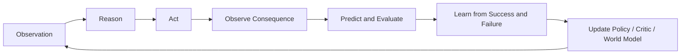

---

# 1. 从 Static VLA 到 Closed-loop Robot Agent

## 1.1 Static VLA 的能力与限制

当前 VLA 通常通过 Behavior Cloning 学习视觉、语言与动作之间的条件映射：

$$
a_t \sim \pi_\theta(a_t \mid o_t,\ell),
$$

其中 \(o_t\) 表示当前视觉或多模态观察，\(\ell\) 表示任务指令，\(a_t\) 表示单步动作或 action chunk。大规模示范数据为策略提供了丰富的语义先验、物体操作模式和跨任务泛化能力，使模型能够在训练分布附近完成复杂操作。

但从闭环角度看，静态 VLA 隐含了三个较强假设：

- 当前观察足以决定后续动作；
- 动作执行期间环境不会发生显著偏移；
- 部署产生的新经验不需要进一步更新模型。

真实机器人通常不满足这些假设。夹爪位置偏移、对象滑动、碰撞、遮挡和外部扰动会让机器人进入示范数据没有覆盖的状态。更重要的是，一次小误差会改变后续观察，使原本合理的动作逐渐失效。静态策略即使看到了新的图像，也可能继续执行基于旧状态生成的动作块；即使多次经历同类失败，也不会自动更新自身。

因此，Closed-loop VLA 不是对行为克隆的简单替代，而是对其能力边界的补充。示范学习回答“机器人从哪里开始”，闭环系统进一步回答：

- **执行层面**：当前动作偏离后如何修正？
- **预测层面**：执行之前能否比较不同未来？
- **学习层面**：失败以后，下一次是否更强？

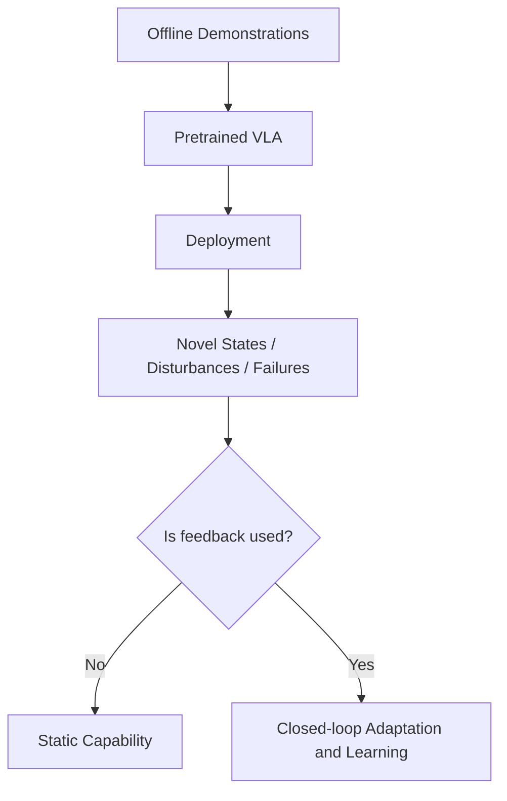

## 1.2 闭环能力并不等同于“调用模型更多次”

闭环的关键不是增加推理次数，而是**新信息是否能够改变后续行为**。例如，多采样若干候选动作并由 verifier 排序，能够提升执行前决策质量；但如果选定后仍完整执行一个长 action chunk，系统对突发扰动的响应仍然有限。相反，一个轻量 residual corrector 即使计算量较小，只要能够持续读取最新观察并修改当前动作，就形成了更直接的物理执行闭环。

因此，分析 Closed-loop VLA 时需要区分：

- 反馈来自真实环境还是 imagined world；
- 反馈在执行前、执行中还是跨 episode 生效；
- 反馈只改变动作，还是进一步改变 policy、critic 或 world model 参数；
- 闭环发生在毫秒、秒级还是多轮部署尺度。

这些差异构成本文三个 Loop 的基本边界。

---

# 2. Closed-loop VLA 的三个闭环

| Loop | 核心问题 | 主要反馈来源 | 典型更新对象 | 时间尺度 | 代表能力 |
|---|---|---|---|---|---|
| **Execution Loop** | 当前动作错了怎么办？ | 最新真实观察、动作不确定性、偏差监控 | 当前动作、执行前缀、动作队列 | 毫秒至秒 | Reactive Correction |
| **Prediction Loop** | 下一步可能发生什么？ | World Model 生成的未来状态、策略评价信号 | 候选动作、计划或策略排序 | 秒级规划周期 | Predictive Decision |
| **Learning Loop** | 如何在多轮交互后持续变强？ | 环境 reward、critic、失败数据、imagined rollout | Policy、critic、World Model | 多轮训练与部署 | Capability Evolution |

三个闭环并不是互斥分类，而是能力逐层增强的结构。Execution Loop 可以在没有 world model 的情况下运行；Prediction Loop 可以只用于评估而不更新策略；Learning Loop 则把前两个环产生的真实反馈和预测后果进一步固化为参数更新。

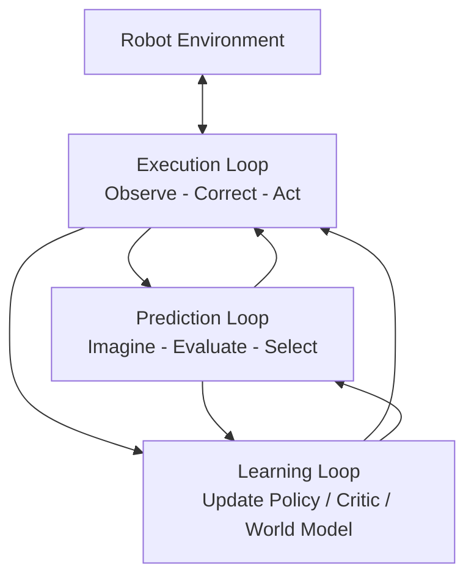

从系统角度看：

- Execution Loop 保证单次任务不因局部偏差立即失败；
- Prediction Loop 在真实动作发生前扩大决策视野；
- Learning Loop 让局部反馈和想象经验成为长期能力。

---

# 3. Execution Loop：从动作生成到实时纠错

## 3.1 为什么需要 Execution Loop？

现代 VLA 为提高动作连贯性和推理吞吐，通常一次生成长度为 \(H\) 的 action chunk：

$$
A_t = (a_t,a_{t+1},\ldots,a_{t+H-1})
\sim \pi_\theta(\cdot \mid o_t,\ell).
$$

系统实际执行其中前 \(h\) 步，再重新调用策略。这里需要区分**生成长度 \(H\)** 与**执行长度 \(h\)**：模型可以生成较长动作序列，但系统未必需要全部执行。闭环设计的关键，正是在效率与反馈频率之间动态选择 \(h\)。

action chunk 本身不是错误设计。它缓解了大模型推理慢、单步动作抖动和控制频率不足的问题。但当 \(h>1\) 时，后续动作 \(a_{t+k}\) 主要根据 chunk 起始时的观察 \(o_t\) 生成，而真实状态已经变为 \(o_{t+k}\)。由此形成 open-loop blind spot：

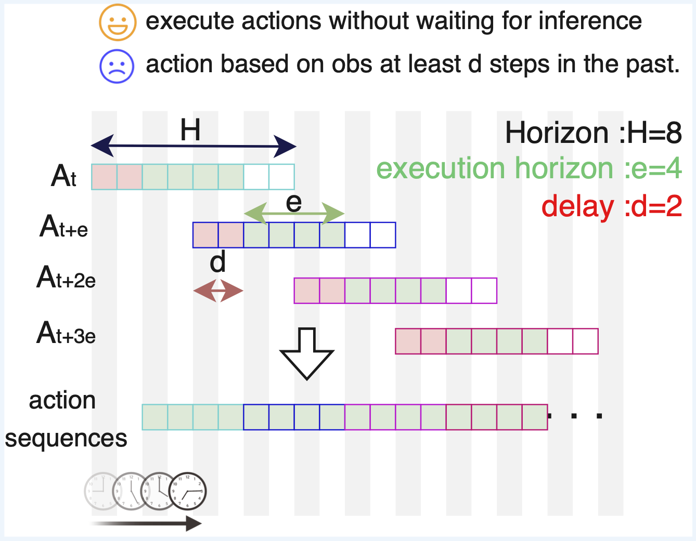

*论文原图：Leave No Observation Behind: Real-time Correction for VLA Action Chunks，Figure 1（[arXiv](https://arxiv.org/abs/2509.23224)）。*

在抓取、插入、推动和柔性物体操作中，这种时间错位尤其明显。接触位置的毫米级偏差可能改变物体姿态，物体姿态变化又让后续动作全部过时。Execution Loop 因此关注：**如何在不等待一次完整离线再训练的情况下，让真实环境的新反馈改变当前动作。**

## 3.2 Candidate Selection：从单次生成到“生成—验证—执行”

Candidate Selection 是较早形成的闭环路径。其基本思想不是要求 policy 一次生成正确答案，而是采样多个候选，再利用独立的 value、reward 或 verifier 选择更优动作：

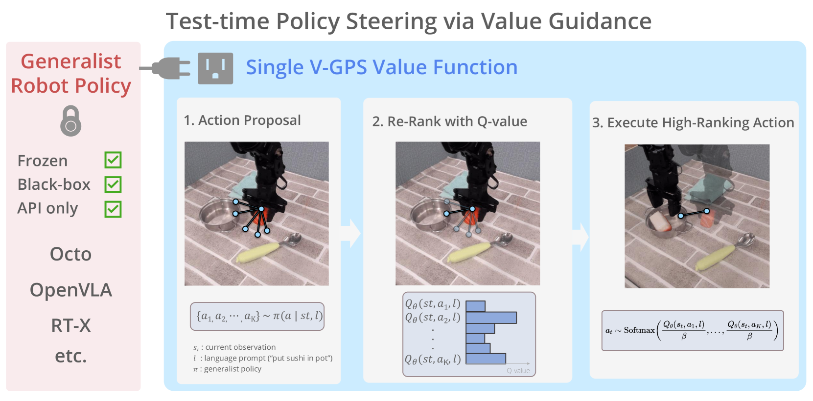

*论文原图：Steering Your Generalists: Improving Robotic Foundation Models via Value Guidance，Figure 1（[arXiv](https://arxiv.org/abs/2410.13816)）。*

这条路线带来了一个重要结构变化：**动作生成与动作评价开始解耦。** VLA 负责提供多样候选，评价模块负责判断哪些候选更可能完成语言目标或获得更高回报。

### V-GPS：Value-guided policy steering

V-GPS [1] 冻结 generalist policy，从策略采样多个候选动作，再使用离线 RL 训练的 language-conditioned value function 进行重排序。其意义并不只在于提升某个具体策略，而在于展示：当 policy 已经具有较好的动作先验时，可以通过独立价值函数在部署阶段重新组织其行为，而不必重新训练整个 VLA。

该方法也揭示了 candidate-selection 方法的两类硬约束：

1. **Candidate coverage**：正确动作必须首先出现在候选集合中；
2. **Verifier calibration**：评价模块必须在当前状态和候选分布上保持可信。

若候选全部属于同一种错误模式，再强的 value function 也无法选出恢复动作；若 value 在 OOD 状态上过度乐观，策略则可能被错误引导。

### RoboMonkey：机器人策略中的 test-time scaling

RoboMonkey [2] 将这一问题进一步表述为 test-time sampling and verification：增加采样数量、对动作进行扰动，并利用 VLM verifier 或 voting 策略筛选候选。该工作的重要作用是建立“部署时计算可以换取策略性能”的研究叙事。

但 test-time scaling 并不意味着计算越多越好。候选高度相关时，增加采样只会重复同类动作；verifier 本身的误判也可能随候选规模被放大。此外，大规模采样和验证会增加延迟，使高频机器人控制难以直接受益。

### FM-Steer：慢评价与快控制的分层

FM-Steer [3] 进一步把低频价值评价与高频动作生成分开：较慢的 verifier 在中间生成状态中选择更高价值方向，轻量 flow denoiser 则以更高频率完成动作细化。这一设计体现了 Execution Loop 的重要趋势：**闭环系统需要多时间尺度，而不是让所有模块以相同频率运行。**

Candidate Selection 解决了“执行前选哪个”的问题，却仍然不能保证动作在执行过程中保持正确。候选一旦被选中，如果环境发生扰动，系统仍可能继续执行 stale chunk。因此研究进一步转向 within-chunk correction。

## 3.3 Execution-time Correction：从执行前选择到执行中恢复

Execution-time Correction 的关键区别在于：系统持续读取最新真实观察，并在当前 action chunk 尚未结束时改变行为。

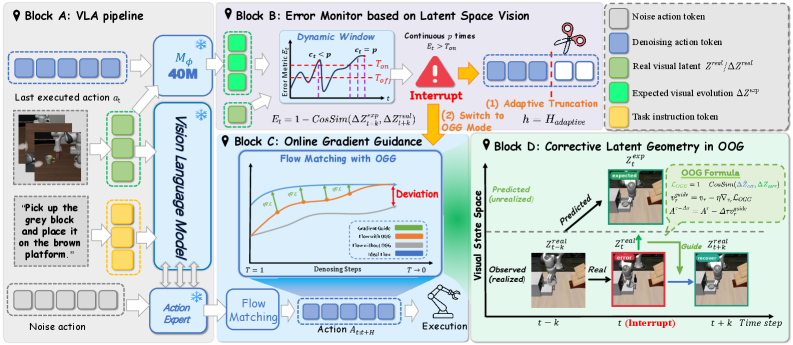

*论文原图：VLA-Corrector: Lightweight Detect-and-Correct Inference for Adaptive Action Horizon，Figure 3（[arXiv](https://arxiv.org/abs/2607.01804)）。*

### RTC：解决推理延迟与 chunk 连续性

Real-Time Chunking（RTC）[4] 关注 action chunk 生成与执行之间的时间错位。当模型同步推理时，机器人可能等待新动作而停顿；朴素异步推理虽然避免停顿，却会让新 chunk 基于已经过时的状态。RTC 在执行当前 chunk 的同时生成下一 chunk，并冻结确定会执行的动作前缀，再通过 flow/diffusion inpainting 保持新旧 chunk 的连续性。

RTC 的贡献是把 VLA 推理和控制变成异步流水线，显著改善 latency robustness 和跨 chunk 连续性。但它主要闭合的是**调度与连续性环**，并不显式判断当前动作是否语义错误。换言之，RTC 可以平滑地执行一段已经过时的计划，因此还需要与偏差监控或任务进展评价结合。

### DREAM-Chunk：在候选动作块之间在线切换

DREAM-Chunk [5] 一次生成多个候选 action chunks，并使用轻量 latent world model 为每个候选预测状态演化。执行过程中，系统把真实观察编码到 latent space，并选择与当前真实状态最匹配的候选轨迹。这使机器人能够在 chunk 内切换，而不是等待整个动作块结束。

其优势是无需每一步重新运行完整 VLA，适合接触任务中的快速反应。局限同样来自 candidate coverage：系统只能在已有候选间切换，若候选中没有恢复路径，latent matching 无法产生新动作。

### A2C2：逐步残差修正

A2C2 [6] 在每个控制步读取最新观察、base VLA action 和 policy features，输出时间相关的 residual correction：

$$
a_t^{exec}=a_t^{base}+\Delta a_t.
$$

该方法计算开销较低，可以直接形成高频物理反馈闭环。相比 chunk switching，它能够连续微调末端轨迹；但 residual correction 的能力通常局限于局部区域。当任务需要换目标、回退或重新抓取时，局部修正不足以完成策略级恢复。

### VLA-Corrector：检测、打断与重新生成

VLA-Corrector [7] 将执行期闭环推进到 event-triggered detect-and-correct。系统持续比较期望与真实视觉 latent evolution，当偏差持续超过阈值时，丢弃剩余 stale actions，并通过 guided replanning 生成新的纠正动作。

该方法比逐步 residual 更接近完整恢复，因为它允许中断原计划并重新生成动作。然而，偏差检测阈值、重新规划开销和冻结 policy 的动作先验仍然限制其稳定性。

## 3.4 Execution Loop 的阶段性结论

Execution Loop 让 VLA 从一次性 Action Generator 转变为 Reactive Controller。其内部又形成两个互补层次：

| 路线 | 介入时机 | 典型操作 | 优势 | 主要限制 |
|---|---|---|---|---|
| Candidate Selection | 执行前 | rerank、value guidance、verification | 易于复用冻结 VLA | 受 candidate coverage 限制 |
| Execution-time Correction | 执行中 | switch、residual、interrupt、replan | 能响应真实偏差 | 实时性与稳定性要求高 |

这一阶段解决的是“当前任务如何尽量做对”，但并未自动回答两个更深层问题：系统如何在执行前比较长期后果，以及一次失败能否改变下一轮模型。这分别推动 Prediction Loop 和 Learning Loop 的出现。

---

# 4. Prediction Loop：World Model 作为内部模拟器

## 4.1 World Model 的角色变化

早期视觉 World Model 主要学习动作条件视频预测，即根据当前图像与动作生成后续帧。此类模型通常以视觉相似度衡量质量，但机器人决策关心的并不是视频是否“看起来像真的”，而是动作和结果之间的因果关系是否被保留。

因此，机器人 World Model 的角色正在经历三个阶段：

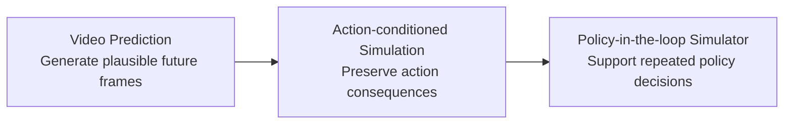

在 Prediction Loop 中，World Model 需要回答：

- 不同动作是否产生可区分的未来？
- 错误动作是否会被错误“修复”为成功？
- 长时 rollout 是否保持物体身份、接触状态和多视角一致性？
- 生成环境是否保持不同 policy 在真实环境中的相对优劣？

因此，评测指标也从单步 FID、LPIPS 等视觉指标，转向 action fidelity、outcome consistency、真实—生成成功率差和 policy ranking correlation。

## 4.2 Action Representation

动作表示是 World Model 中从策略意图到物理后果的接口。若动作条件无法准确表达方向、位姿、夹爪状态与执行频率，模型就可能依赖语言和场景先验自动生成“常见成功结局”。当前方法主要形成三类表示。

### Policy Latent

WorldEval [8] 使用 policy 内部 latent 表示动作意图，不要求不同策略显式共享同一笛卡尔动作空间。该设计工程成本较低，适合同平台多 checkpoint 或多 policy 的快速筛选。

但 policy latent 缺乏直接可解释性。两个物理后果不同的动作可能在 latent 中过近，而更换 policy 架构后，条件分布也会发生变化。因此它更适合相对排名，而不适合作为跨本体、精细接触的统一物理接口。

### Explicit Geometric Action

PiL-World、OSCAR 和 GigaWorld-1 [12]–[14] 将动作显式投影为 trajectory、pose map、2D skeleton 或 ray map，使动作条件与视频像素和时间帧对齐。其核心优势是 action grounding：模型可以直接看到机械臂在每个时刻应该位于哪里。

显式表示提高了动作可解释性，也便于进行轨迹反转、单轴扰动和 action shuffle 等压力测试。但它依赖相机标定、机器人运动学和视角可见性。对移动操作、灵巧手和柔性本体而言，统一的几何接口仍然较难设计。

### Discrete Action Token

dWorldEval [11] 将视觉、语言和连续动作都离散化为 token，并交给统一的生成模型处理。其优势是多模态接口一致、易于并行解码，也可以同时输出 progress token。

风险则来自量化：若两个接触后果不同的动作被编码为相同 token，后续模型无法恢复这种差异。离散表示的可靠性因此不仅取决于生成模型，还取决于 tokenizer 是否保留决策相关信息。

| 动作表示 | 代表方法 | 优势 | 关键风险 | 适用场景 |
|---|---|---|---|---|
| Policy latent | WorldEval | 改造成本低、适合多 checkpoint | 不透明、随 policy 架构漂移 | 同平台策略筛选 |
| 连续 pose / trajectory | Ctrl-World | 数值动作直接、时间对齐清晰 | 控制频率和坐标系差异 | 标准化控制接口 |
| Skeleton / pose map / ray map | OSCAR、PiL-World、GigaWorld-1 | 空间可解释、动作忠实性较强 | 标定和运动学依赖 | 多视角与跨本体评测 |
| Discrete action token | dWorldEval | 视觉语言动作统一 | 量化误差和序列长度 | 大规模自动评测 |

## 4.3 Policy-in-the-loop：从重放视频到模拟决策过程

开放环 World Model 固定整段动作，仅检验模型是否重放出合理后果。该设置便于隔离动作跟随误差，却无法反映部署中的闭环耦合：真实 VLA 会根据每一步新观察重新生成动作。

Policy-in-the-loop 将生成观察反馈给 policy，使策略和 World Model 交替运行：

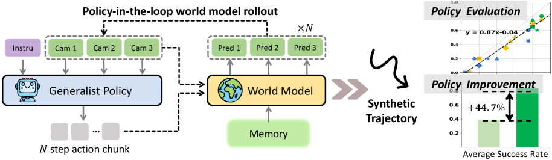

*论文原图：Ctrl-World: A Controllable Generative World Model for Robot Manipulation，Figure 1（[arXiv](https://arxiv.org/abs/2510.10125)）。*

WorldGym、Ctrl-World 和 PiL-World [9], [10], [13] 分别推动了闭环策略评测。PiL-World 特别强调 action chunk 与生成帧的时间对齐：World Model 生成下一段观察后，不仅需要更新视觉输入，还要同步更新 policy 所依赖的 proprioception。否则视觉世界已经前进，而机器人内部状态仍停留在上一轮，策略排序将失去意义。

Policy-in-the-loop 更接近真实部署，但也会放大模型误差。某一步中物体位置的轻微漂移可能诱导 policy 输出不同动作，新动作又把 World Model 推向训练分布之外。因此闭环高相关性必须与开放环动作重放、中间状态检查和真实机器人锚点共同使用。

## 4.4 Prediction Loop 的阶段性结论

Prediction Loop 让机器人从“执行后再观察”转向“执行前先想象”。但 World Model 的价值并不取决于单纯视频质量，而取决于它是否保持决策相关的因果结构：

- 动作改变时，未来结果是否正确变化；
- 失败动作是否仍被预测为失败；
- 长时状态是否稳定；
- policy ranking 是否与真实环境一致。

这也解释了为什么 Prediction Loop 自然通向 Learning Loop：一旦 World Model 被用于生成训练数据或 reward，其偏差就不再只是评测误差，而会直接影响 policy 更新。

---

# 5. Learning Loop：从策略适应到自主进化

## 5.1 Policy-centric Learning Loop

Execution Loop 和 Prediction Loop 主要改变当前决策，却不一定改变模型参数。Learning Loop 进一步关注：部署产生的新状态和失败，如何进入下一轮训练。

最初的 Learning Loop 以 policy 为中心：

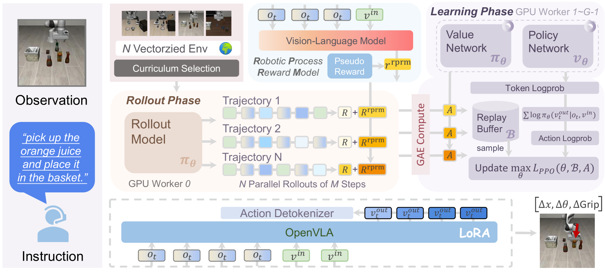

*论文原图：VLA-RL: Towards Masterful and General Robotic Manipulation with Scalable Reinforcement Learning，Figure 2（[arXiv](https://arxiv.org/abs/2505.18719)）。*

### VLA-RL：让 VLA 重新连接环境反馈

VLA-RL [16] 试图解决静态行为克隆的根本限制：VLA 即使在部署中遇到失败，也不会自动调整参数。该方法将自回归 VLA 与 trajectory-level PPO 结合，通过完整轨迹上的环境反馈和 value estimation 更新策略。

机器人任务通常只提供终局二值奖励，难以判断中间动作是否推动任务进展。VLA-RL 因此引入 Robotic Process Reward Model（RPRM），从成功轨迹中自动提取阶段性里程碑，并为中间动作提供过程奖励。训练反馈可概括为：

$$
r_t = r_t^{env} + r_t^{RPRM}.
$$

VLA-RL 的关键贡献不是 PPO 本身，而是建立了“机器人执行—获得反馈—更新 VLA”的 Policy-centric Learning Loop。其限制也很明确：环境 rollout、并行仿真或真实机器人 reset 成本较高，过程奖励质量会直接决定策略更新方向。

### VLAC：从稀疏结果到通用视觉 Critic

VLA-RL 证明 policy 可以继续学习，但反馈仍然是瓶颈。VLAC [17] 将任务评价建模为前后视觉状态之间的相对进展：

$$
(\Delta p_t,d_t)=C_\psi(o_t,o_{t+1},\ell),
$$

其中 \(\Delta p_t\) 表示进展、停滞或回退，\(d_t\) 表示任务是否完成。相比逐任务手工设计 reward，VLAC 直接利用语言目标与视觉变化产生 critic feedback，更适合多任务真实机器人学习。

其贡献是补强 Learning Loop 中的 Evaluation 环节：失败、中间进展和局部退步都可以成为更新信号。但 learned critic 并不等于真实环境本身。若 critic 在某些视觉模式上存在系统偏差，policy optimization 可能主动放大这种偏差。

## 5.2 World Model 进入 Learning Loop

### DreamerV3：方法论桥梁

DreamerV3 [15] 不是 VLA 论文，但提供了 World Model 进入 RL 的基础范式。系统从真实经验中学习 latent dynamics、reward 和 continuation，再在 latent imagination 中训练 actor 与 critic：

*论文原图：Mastering Diverse Domains through World Models，Figure 3(a)-(b)（[arXiv](https://arxiv.org/abs/2301.04104)）。*

DreamerV3 说明：真实环境主要负责提供 grounding，策略的大量更新可以发生在 imagined world 中。将这一思想迁移到 VLA 后，问题变得更加困难，因为机器人 World Model 需要处理高维视频、action chunk、语言条件与接触物理。更危险的是，RL 不会被动承受模型误差，而会主动搜索能够获得高预测回报的漏洞。

## 5.3 World-VLA-Loop：Policy–World Model Co-evolution

World-VLA-Loop [18] 是本文 Learning Loop 主线中的关键转折。它不仅使用 World Model 帮助 policy 学习，还让新 policy 产生的数据反过来更新 World Model。

### 核心挑战：策略会系统性放大模型错误

假设 World Model 错误地预测一个偏离目标的推动动作仍会成功。普通视频预测中，这只是一次 hallucination；在 RL 中，策略会发现该动作获得高 reward，并持续提高其概率。最终 policy 学到的是“欺骗模拟器”，而不是完成真实任务。

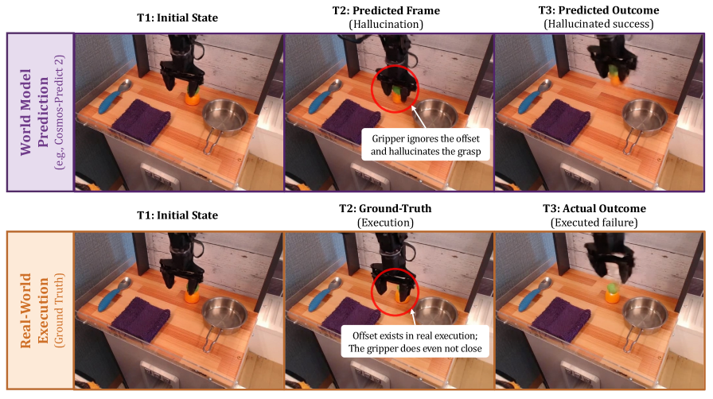

*论文原图：World-VLA-Loop: Closed-Loop Learning of Video World Model and VLA Policy，Figure 2（[arXiv](https://arxiv.org/abs/2602.06508)）。*

因此，World Model 的动作—结果一致性和 reward calibration 不是附加指标，而是 policy optimization 能否迁移到真实环境的前提。

### SANS：用 near-success 学习能力边界

World-VLA-Loop 构建 SANS（Successful and Near-Success）数据。与明显失败相比，near-success 轨迹通常只因末端位置、推动方向或动作时机的微小偏差而失败。它们与成功轨迹共享大部分场景和动作结构，因此更直接地刻画成功边界。

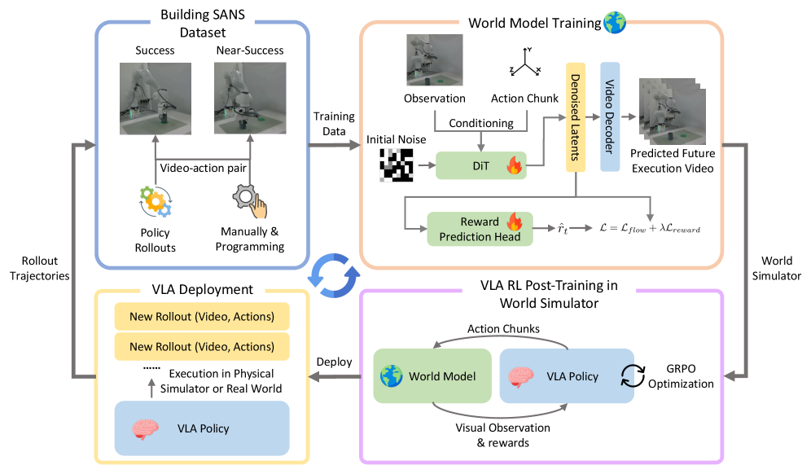

*论文原图：World-VLA-Loop: Closed-Loop Learning of Video World Model and VLA Policy，Figure 3（[arXiv](https://arxiv.org/abs/2602.06508)）。*

SANS 的核心不是“增加更多失败”，而是增加**困难负样本**。这些样本迫使 World Model 学习哪些微小动作差异真正决定任务成败，减少模型依赖任务文本和场景先验自动补全成功结果。

### Joint Video-Reward Prediction

World-VLA-Loop 让 World Model 同时预测未来视频与 step-wise reward：

$$
(\hat{o}_{t+1:t+H},\hat{r}_{t:t+H})
\sim
M_\phi(o_t,a_{t:t+H-1}).
$$

Reward head 建立在视频 diffusion 的共享 latent 上，使视觉结果与优化信号受到联合监督。其目标是避免“视频表现为失败、reward 却判断成功”的脱节，提高 action-outcome 和 video-reward alignment。

### 基于 World Model 的 GRPO

训练后的 World Model 被用作虚拟环境。VLA 在生成状态上提出动作，World Model 产生下一观察与奖励，GRPO 再比较多条 imagined trajectories 的相对回报并更新 policy。

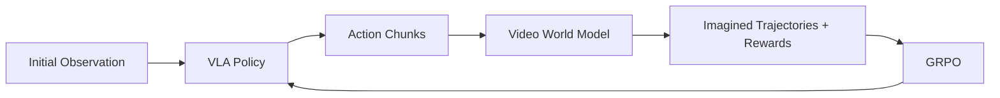

### 真正的闭环：新策略数据反向校准 World Model

单轮 imagined RL 仍不能保证长期可靠，因为更新后的 policy 会访问新的动作分布。World-VLA-Loop 将 policy 部署回目标环境，收集其新的 success、failure 和 near-success trajectories，再用于更新下一版 World Model：

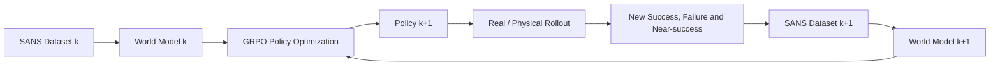

由此形成：

$$
M_k \rightarrow \pi_{k+1}
\rightarrow \mathcal{D}^{real}_{k+1}
\rightarrow M_{k+1}.
$$

World-VLA-Loop 的核心贡献不是“使用了 World Model”，而是让 World Model 成为 Learning Loop 中持续被新策略数据修正的学习对象。系统从单向的“模型帮助策略”升级为双向的 Policy–World Model co-evolution。

## 5.4 Beyond World-VLA-Loop：经验规模与模拟可靠性

World-VLA-Loop 建立了双向更新关系，但仍留下两个互补问题：

1. 有限真实数据能否扩展为足够多的有效经验？
2. imagined rollout 足够多以后，如何确保其可靠？

### VLAW：Experience Scaling

VLAW [19] 关注经验规模。当前 policy 先在真实机器人上收集少量 success/failure rollouts，用于校准 Action-conditioned World Model 和视觉语言 reward model；随后 policy 与 World Model 闭环交互，生成大量 synthetic trajectories，再由 reward model 筛选高置信成功轨迹，并用真实与合成 observation-action pairs 更新 VLA。

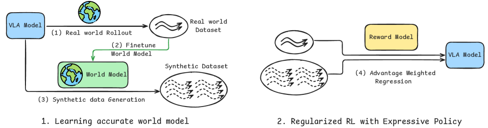

*论文原图：VLAW: Iterative Co-Improvement of Vision-Language-Action Policy and World Model，Figure 3（[arXiv](https://arxiv.org/abs/2602.12063)）。*

需要注意的是，VLAW 的实际 policy update 更接近对筛选成功数据进行加权 flow-matching 监督训练，而不是标准 PPO 或 GRPO。其优势是训练稳定、能够扩大成功经验；风险是 World Model 或 reward model 的 false positive 会被大规模复制。

### WoVR：Simulation Reliability

WoVR [20] 关注 imagined RL 的可靠性。其核心判断是：无法假设 World Model 完美，更现实的目标是控制其误差如何进入 policy optimization。

WoVR 从三个层面处理问题：

| 层面 | 机制 | 目标 |
|---|---|---|
| Simulator | 动作条件注入、首帧锚定、上下文增强 | 减少视觉漂移和动作失控 |
| Interaction | Keyframe-Initialized Rollouts（KIR） | 缩短有效预测深度 |
| Alignment | PACE | 用新 policy 数据低频校准 World Model |

KIR 不从任务初态生成完整长轨迹，而是跳过早期前缀，从关键操作或失败附近的真实 keyframe 开始 imagined rollout：

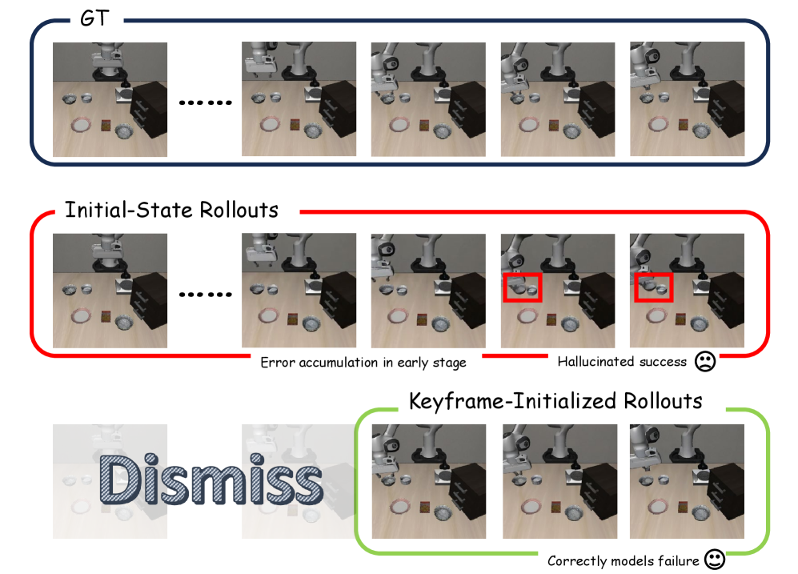

*论文原图：WoVR: World Models as Reliable Simulators for Post-Training VLA Policies with RL，Figure 4（[arXiv](https://arxiv.org/abs/2602.13977)）。*

这样既减少误差累积，也让 GRPO 更聚焦于真正决定任务成败的局部动作。PACE 则用 evolved policy 的少量真实 rollout 更新 World Model，使模拟器重新覆盖当前 policy 分布。

### 三类 Co-evolution 方法的区别

| 方法 | 核心关注 | World Model 角色 | Policy update | 模型更新信号 |
|---|---|---|---|---|
| World-VLA-Loop | Action-outcome 与 reward alignment | 带 reward 的 RL simulator | GRPO | 新 policy 的 failure / near-success |
| VLAW | 合成经验规模 | Synthetic data generator | 加权 flow matching | 每轮真实 policy rollout |
| WoVR | imagined RL 可靠性 | 受可靠性控制的 RL simulator | GRPO | PACE 低频对齐数据 |

三者分别强化了 Policy–World Model Learning Loop 的 **Alignment、Scale 与 Reliability**。

## 5.5 Learning Loop 的阶段性结论

Learning Loop 的技术演化可以概括为：

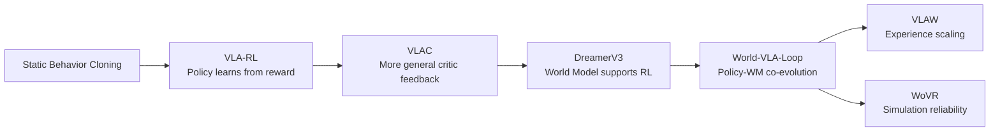

这里的研究重心逐步发生变化：

- 首先解决 policy 能否从反馈中学习；
- 随后解决反馈是否足够通用；
- 再引入 World Model 扩大交互空间；
- 最后让 policy、critic 与 World Model 共同适应不断变化的数据分布。

---

# 6. Unified Closed-loop Robot Intelligence Stack

三个 Loop 不是三个独立模块，而是一个嵌套的智能栈：

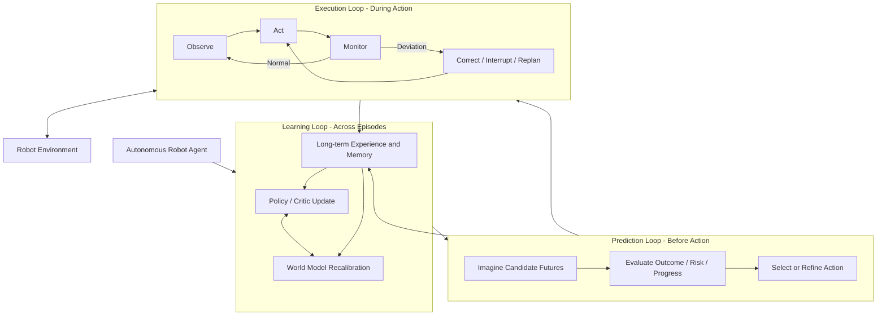

从信息流看：

- **Execution Loop** 产生真实偏差、恢复过程和安全反馈；
- **Prediction Loop** 产生候选未来、风险判断和反事实经验；
- **Learning Loop** 将这些信息固化为 policy、critic、World Model 和长期记忆的更新。

从时间尺度看，一个合理系统可能采用：

| 时间尺度 | 主要模块 | 典型职责 |
|---|---|---|
| 20–100 Hz | Monitor / Residual Controller / Safety Filter | 高频纠错与安全控制 |
| 5–20 Hz | VLA Action Chunk / Asynchronous Scheduler | 动作生成与队列维护 |
| 1–5 Hz | World Model / Value / VLM Verifier | 低频预测、候选评价与重规划 |
| 跨 episode | RL / World Model Update / Memory | 长期能力积累 |

因此，真正自主的 Closed-loop VLA 更可能是多模块、多频率系统，而不是单一模型在所有尺度上承担全部功能。

---

# 7. Open Challenges

## 7.1 Trustworthy World Model

当 World Model 进入决策与学习环后，“什么时候可以相信 imagined rollout”成为首要问题。现有系统通常通过 reward threshold、KIR、关键帧或额外真实数据间接控制错误，但缺少统一、可校准的不确定性。

未来系统需要同时判断：

- 当前动作是否超出 World Model 的训练支持集；
- 哪一步开始出现明显漂移；
- 应该继续 rollout、提前终止，还是请求真实机器人交互；
- imagined reward 是否与视觉结果一致。

可信 World Model 的评价也不能只依赖视频质量，而应报告 action sensitivity、success/failure calibration、policy ranking preservation 和误差随 horizon 的增长。

## 7.2 Failure-driven Learning

失败不是单一的二值标签。机器人失败可能来自感知误差、接触位姿偏差、动作时序错误、策略规划错误或 World Model 幻觉。若所有失败只被标记为 0，系统很难学习可迁移的恢复知识。

更有价值的方向包括：

- 主动采集 near-success 和可恢复失败；
- 将失败分解为可解释的技能边界；
- 利用 policy–model disagreement 选择数据；
- 建立跨任务的 failure memory 与 recovery primitives。

World-VLA-Loop 的 SANS 已说明能力边界数据的重要性，但从 task-specific near-success 走向跨任务 failure concepts 仍有较大空间。

## 7.3 Policy–World Model Stability

当 policy、critic 和 World Model 同时变化时，系统形成三重非平稳性：

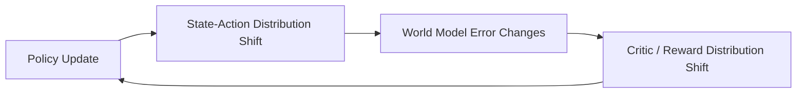

更新过慢会造成 simulator 与 policy 失配；更新过快则可能过拟合新数据、遗忘旧能力或形成正反馈漏洞。未来需要：

- 数据和模型版本化；
- 固定评测器与自适应训练模型分离；
- 保守更新和回滚机制；
- imagined-to-real performance gate；
- 旧数据重放与跨轮校准。

## 7.4 Multi-timescale Intelligence

不同闭环天然运行在不同频率。World Model 搜索和 VLM 评价可能需要秒级计算，视觉监控和安全控制则需要几十赫兹。若所有模块同步运行，系统要么延迟过高，要么评价能力不足。

未来的多时间尺度架构应根据状态风险和不确定性动态分配计算：

- 低风险、稳定阶段执行更长 action horizon；
- 接触和高不确定阶段提高观察与纠错频率；
- 只有在任务偏离或价值分歧较大时调用重型 World Model；
- 跨 episode 再进行较慢的 policy / model update。

这一方向将 test-time scaling 从“更多计算”转变为“在正确时间使用正确计算”。

---

# 8. Conclusion

Closed-loop VLA 的技术演化可以概括为从静态动作预测到三个闭环逐步进入机器人系统：

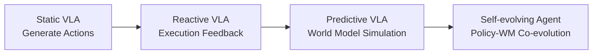

Execution Loop 让机器人能够在当前任务中根据真实反馈调整行为；Prediction Loop 让机器人在执行之前模拟未来并比较决策；Learning Loop 则把反馈、失败和 imagined experience 固化为长期能力。

从这一视角看，未来 VLA 的核心问题不只是模型能否生成更好的动作，而是系统能否持续回答：

- 当前行为是否偏离？
- 不同动作会产生什么后果？
- 哪些预测值得相信？
- 一次失败应该如何改变下一轮 policy 和 World Model？

真正的自主机器人智能体需要同时具备感知、预测、行动、纠错、评价、学习和长期记忆能力。闭环能力不是对模型规模的替代，而是让基础模型真正进入物理世界并持续适应的必要条件。

---

---

# References

以下链接均指向论文的 arXiv 页面。FM-Steer 在 arXiv 上以 **Hume: Introducing System-2 Thinking in Visual-Language-Action Model** 为题发布。

## Execution Loop

[1] M. Nakamoto, O. Mees, A. Kumar, and S. Levine,  
“[Steering Your Generalists: Improving Robotic Foundation Models via Value Guidance](https://arxiv.org/abs/2410.13816),” arXiv:2410.13816, 2024.

[2] J. Kwok et al.,  
“[RoboMonkey: Scaling Test-Time Sampling and Verification for Vision-Language-Action Models](https://arxiv.org/abs/2506.17811),” arXiv:2506.17811, 2025.

[3] H. Song et al.,  
“[Hume: Introducing System-2 Thinking in Visual-Language-Action Model](https://arxiv.org/abs/2505.21432),” arXiv:2505.21432, 2025.  
（本文所述 FM-Steer 对应的 arXiv 版本。）

[4] K. Black, M. Y. Galliker, and S. Levine,  
“[Real-Time Execution of Action Chunking Flow Policies](https://arxiv.org/abs/2506.07339),” arXiv:2506.07339, 2025.

[5] W. Chen et al.,  
“[DREAM-Chunk: Reactive Action Chunking with Latent World Model](https://arxiv.org/abs/2606.18589),” arXiv:2606.18589, 2026.

[6] K. Sendai, M. Alvarez, T. Matsushima, Y. Matsuo, and Y. Iwasawa,  
“[Leave No Observation Behind: Real-time Correction for VLA Action Chunks](https://arxiv.org/abs/2509.23224),” arXiv:2509.23224, 2025.

[7] Y. Pan et al.,  
“[VLA-Corrector: Lightweight Detect-and-Correct Inference for Adaptive Action Horizon](https://arxiv.org/abs/2607.01804),” arXiv:2607.01804, 2026.

## Prediction Loop

[8] Y. Li, Y. Zhu, J. Wen, C. Shen, and Y. Xu,  
“[WorldEval: World Model as Real-World Robot Policies Evaluator](https://arxiv.org/abs/2505.19017),” arXiv:2505.19017, 2025.

[9] J. Quevedo, A. K. Sharma, Y. Sun, V. Suryavanshi, P. Liang, and S. Yang,  
“[WorldGym: World Model as An Environment for Policy Evaluation](https://arxiv.org/abs/2506.00613),” arXiv:2506.00613, 2025.

[10] Y. Guo, L. X. Shi, J. Chen, and C. Finn,  
“[Ctrl-World: A Controllable Generative World Model for Robot Manipulation](https://arxiv.org/abs/2510.10125),” arXiv:2510.10125, 2025.

[11] Y. Li, Z. Zhou, Y. Chen, Y. Xue, and Y. Zhu,  
“[dWorldEval: Scalable Robotic Policy Evaluation via Discrete Diffusion World Model](https://arxiv.org/abs/2604.22152),” arXiv:2604.22152, 2026.

[12] Z. Wu and J. Gao,  
“[OSCAR: Omni-Embodiment Action-Conditioned World Model for Robotics](https://arxiv.org/abs/2606.04463),” arXiv:2606.04463, 2026.

[13] C. Ma et al.,  
“[PiL-World: A Chunk-Wise World Model for VLA Policy-in-the-Loop Evaluation](https://arxiv.org/abs/2606.05773),” arXiv:2606.05773, 2026.

[14] GigaWorld Team et al.,  
“[GigaWorld-1: A Roadmap to Build World Models for Robot Policy Evaluation](https://arxiv.org/abs/2607.02642),” arXiv:2607.02642, 2026.

## Learning Loop

[15] D. Hafner, J. Pasukonis, J. Ba, and T. Lillicrap,  
“[Mastering Diverse Domains through World Models](https://arxiv.org/abs/2301.04104),” arXiv:2301.04104, 2023.

[16] G. Lu et al.,  
“[VLA-RL: Towards Masterful and General Robotic Manipulation with Scalable Reinforcement Learning](https://arxiv.org/abs/2505.18719),” arXiv:2505.18719, 2025.

[17] S. Zhai et al.,  
“[A Vision-Language-Action-Critic Model for Robotic Real-World Reinforcement Learning](https://arxiv.org/abs/2509.15937),” arXiv:2509.15937, 2025.

[18] X. Liu, Z. Bai, H. Ci, K. Y. Ma, and M. Z. Shou,  
“[World-VLA-Loop: Closed-Loop Learning of Video World Model and VLA Policy](https://arxiv.org/abs/2602.06508),” arXiv:2602.06508, 2026.

[19] Y. Guo, T. Lee, L. X. Shi, J. Chen, P. Liang, and C. Finn,  
“[VLAW: Iterative Co-Improvement of Vision-Language-Action Policy and World Model](https://arxiv.org/abs/2602.12063),” arXiv:2602.12063, 2026.

[20] Z. Jiang et al.,  
“[WoVR: World Models as Reliable Simulators for Post-Training VLA Policies with RL](https://arxiv.org/abs/2602.13977),” arXiv:2602.13977, 2026.
